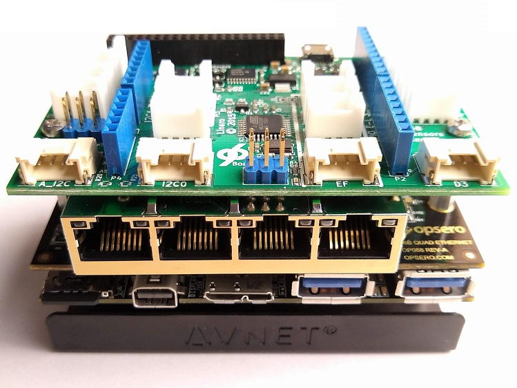
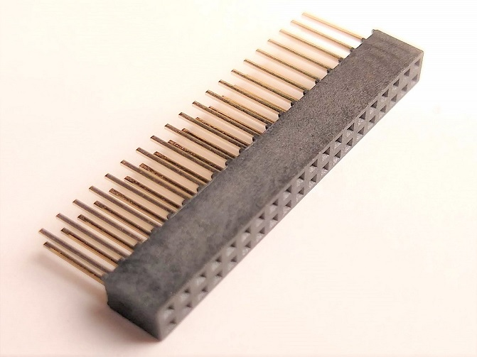
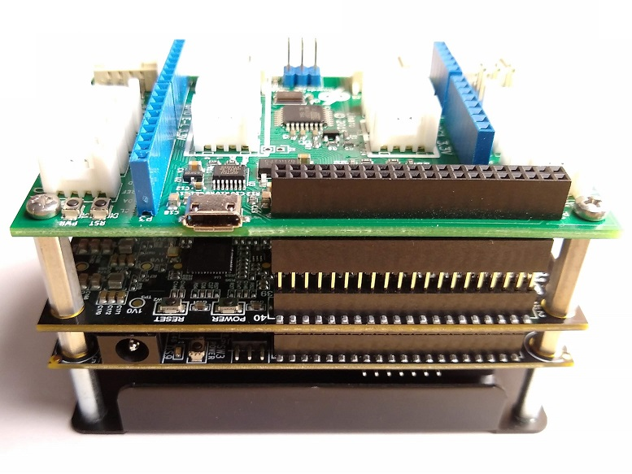

===========
Board Setup
===========

Mezzanine fastening hardware
============================

For typical development use, in a lab or on a desk, the mating force of the expansion connectors alone is
enough to securly fix the mezzanine card to the carrier board. However, for applications requiring higher 
mechanical robustness, the mezzanine can be fixed to the carrier board using 7mm standoffs and M2.5 machine
screws. We suggest the following part numbers, however equivalent parts can also be used:

* | Hex standoff, Thread M2.5 x 0.45, Aluminium, Board-to-board length 7mm
  | **Part number:** M2102-2545-AL
  | **Manufacturer:** RAF Electronic Hardware

* | Machine screw, Thread M2.5 x 0.45, Length (below head) 4mm, Stainless steel, Phillips head
  | **Part number:** 425-035
  | **Supplier:** Spaenaur

Stacking a second mezzanine
===========================

A second mezzanine card can be stacked on top of the 96B Quad Ethernet Mezzanine as shown in the image below.
  

    
    96B Quad Ethernet Mezzanine with stacked Sensors mezzanine (front)

The RJ45 connector (`0826-1X4T-23-F <https://belfuse.com/resources/StewartConnector/0826-1X4T-23-F.pdf>`_) 
has a height of 13.59mm, while the expansion socket has a height of 4.5mm as defined by the 96Boards spec.
For this reason, an extender (see image below) is required for stacking most mezzanine cards onto the 96B Quad 
Ethernet Mezzanine. The extender is a 40-pin pin socket with 8mm long pins that is inserted into the 96B
Quad Ethernet Mezzanine's low-speed expansion socket, effectively increasing it's height above that of the RJ45
connector. The stacked mezzanine card is then plugged into the extender socket and sits comfortably above the 
RJ45 connector. We recommend that the following connector be used as the extender socket, however equivalent 
parts can also be used:

* | 40-pin Pin socket with 8mm long pins
  | **Part number:** F263-1220A0BSYE1
  | **Manufacturer:** Yxcon

    
    Extender for stacking second mezzanine card

When using the extender socket recommended above, the stacked mezzanine sits at a height of 16mm above the 
96B Quad Ethernet Mezzanine, and it can be fixed to the mezzanine by using 16mm standoffs and M2.5 machine 
screws. We suggest the following part numbers, however equivalent parts can also be used:

* | Hex standoff, Thread M2.5 x 0.45, Aluminium, Board-to-board length 16mm
  | **Part number:** M2111-2545-AL
  | **Manufacturer:** RAF Electronic Hardware
  
* | Machine screw, Thread M2.5 x 0.45, Length (below head) 4mm, Stainless steel, Phillips head
  | **Part number:** 425-035
  | **Supplier:** Spaenaur

The image below illustrates the use of the extender socket and 16mm standoffs.
  

    
    96B Quad Ethernet Mezzanine with stacked Sensors mezzanine (back)

