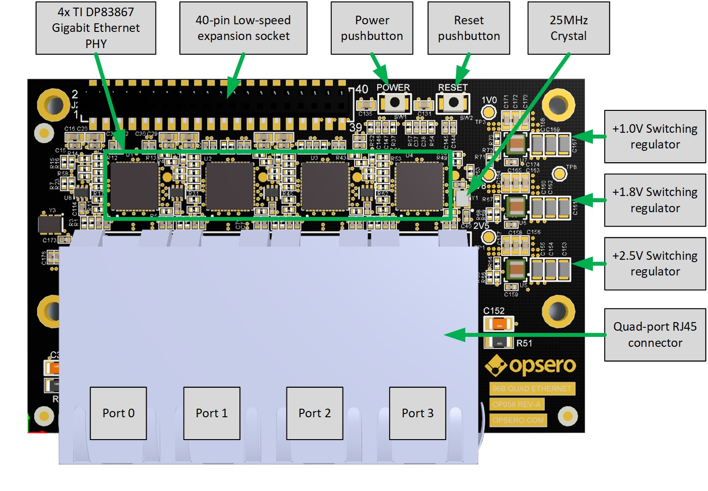
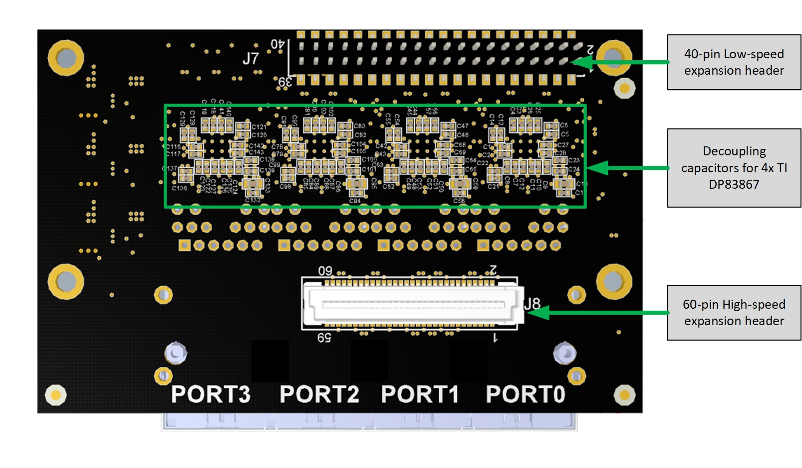
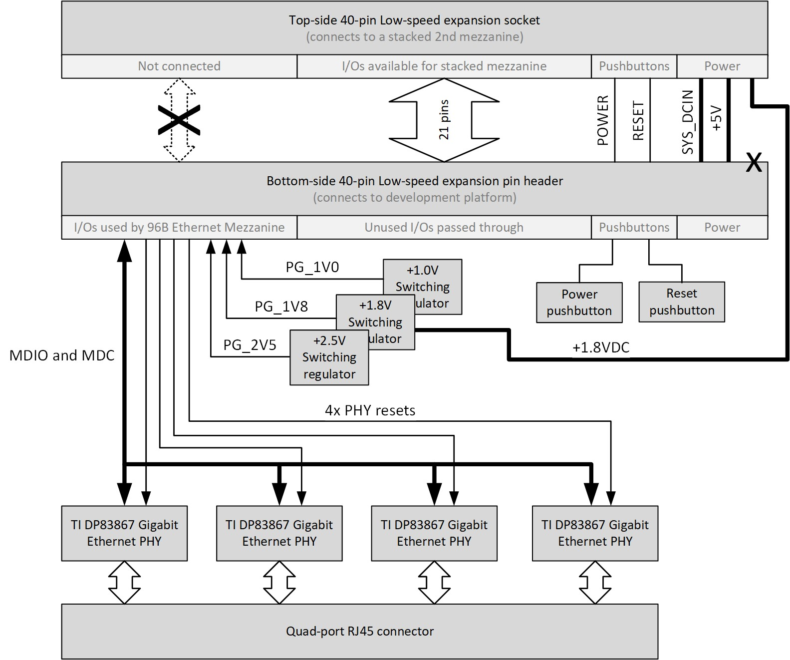
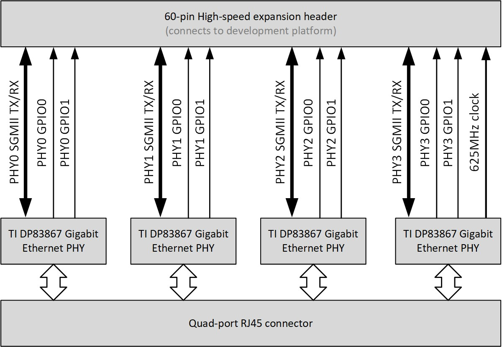
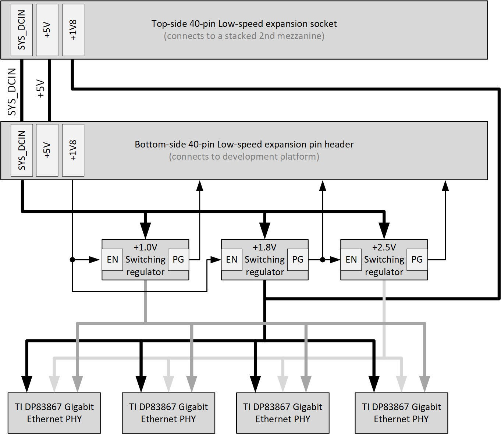

====================
Detailed Description
====================

Hardware Overview
=================

The figure below illustrates the various hardware components that are located
on the top-side of the 96B Quad Ethernet Mezzanine card.

    
    Mezzanine card labelled top-side
    
The main components on the top-side of the mezzanine card are:

* 4x TI DP83867 Gigabit Ethernet PHYs
* 40-pin low-speed expansion socket for stacking a second mezzanine
* Power and reset pushbuttons
* 25MHz crystal
* Switching regulators for +1.0V, +1.8V and +2.5V
* Quad-port RJ45 connector

The figure below illustrates the various hardware components that are located on
the bottom-side of the mezzanine card.

    
    Mezzanine card labelled bottom-side

The main components on the bottom-side of the mezzanine card are:

* 40-pin low-speed expansion header
* Decoupling capacitors for the DP83867 Ethernet PHYs
* 60-pin high-speed expansion header

TI DP83867 Gigabit Ethernet PHY
===============================

There are 4x TI DP83867 Gigabit Ethernet PHYs on the mezzanine card, one for each
of the four Gigabit Ethernet ports. For interfacing with a MAC, the DP83867 has 
both RGMII and SGMII interfaces, however the mezzanine card only uses the SGMII
interface of each PHY. The DP83867 is designed for low-power, it has low-latency
and it provides IEEE 1588 Start of Frame Detection. For more specific information
on the DP83867, please refer to the `datasheet <http://www.ti.com/product/DP83867CS>`_.

In this documentation, we will refer to the PHYs as PHY0, PHY1, PHY2 and PHY3, 
corresponding to their placement from left-to-right and as shown in 
:numref:`96b-quad-ethernet-top-labelled`.

Low-speed expansion connectors
==============================

The 96B Quad Ethernet Mezzanine has two low-speed expansion connectors: a pin header
on the bottom-side, and a pin socket on the top-side. The pin header interfaces with
the development platform, while the pin socket is used for "stacking" a second 
mezzanine card on top of the 96B Quad Ethernet Mezzanine.
The figure below illustrates the connections to the low-speed expansion pin header 
(bottom side) and socket (top side).

    
    Low-speed expansion and stacking connectors
    
Bottom-side low-speed expansion pin header
------------------------------------------

The 96B Quad Ethernet Mezzanine has a 40-pin low-speed expansion pin header, located on the
bottom side of the board (see :numref:`96b-quad-ethernet-bottom-labelled`). This pin header
connects directly to the development platform and it provides the main power supply to the 
96B Quad Ethernet Mezzanine card as well as various I/O signals used by the mezzanine:

* SYS_DCIN (the main power supply)
* Power and reset pushbuttons
* MDIO and MDC signals for the Ethernet PHYs
* Reset signals for the Ethernet PHYs
* Power good signals from the switching regulators

Top-side low-speed expansion socket
-----------------------------------

Not all of the I/Os on the low-speed expansion header are used by the 96B Quad Ethernet
Mezzanine card. To make these unused I/Os accessible to another mezzanine card, the 96B Quad Ethernet
Mezzanine was designed with a 40-pin low-speed expansion socket, located on the top-side of the board
(see :numref:`96b-quad-ethernet-top-labelled`). This expansion socket connects to all of
the unused I/Os of the 96B Quad Ethernet Mezzanine, as well as the power/reset 
pushbuttons and the power supplies. It is designed to allow a standard 96Boards mezzanine
card to be "stacked" on top of the 96B Quad Ethernet Mezzanine.

There are 21 unused I/Os that are passed through from the low-speed header to the low-speed
socket and can be used by a "stacked" (2nd) mezzanine:

* UART0_CTS,TXD,RXD,RTS
* UART1_TXD,RXD
* I2C0_SCL,SDA
* I2C1_SCL,SDA
* SPI0_SCL,DIN,CS,DOUT
* PCM_FS,CLK,DO,DI
* GPIO-A,B,C

All power supply pins SYS_DCIN, +5V and +1V8 are connected to the appropriate supplies
however only SYS_DCIN and +5V are directly passed through from the bottom-side low-speed
expansion header. The +1V8 power supply is instead connected to the +1.8V that is generated 
by the 96B Quad Ethernet Mezzanine's on-board switching regulator. This allows the "stacked" 
mezzanine card to draw more than the standard's 100mA limit from the +1.8V supply.

The POWER and RESET pushbuttons are directly passed through. 

High-speed expansion connector
==============================

The 96B Quad Ethernet Mezzanine has a 60-pin high-speed expansion header for interfacing
with high-speed I/Os on the development platform. The mezzanine uses most of these I/Os for
interfacing the SGMII links and the GPIO0/1 outputs of the DP83867 PHYs.

    
    High-speed expansion connector

Each SGMII link is composed of two differential pairs, one for the transmit signal and one
for the receive signal. These links typically operate at 1.25Gbps in each direction. These
differential pairs are routed on the 96B Quad Ethernet Mezzanine with a controlled 
differential impedance of 100 ohms.

The DP83867 PHYs have two outputs, named GPIO0 and GPIO1, that can be used for Start of
Frame detection among other things (see `datasheet <http://www.ti.com/product/DP83867CS>`_
for details). Both of these outputs are routed through the high-speed expansion header so
that they can be used by the development platform.

Power Supplies
==============

The 96B Quad Ethernet Mezzanine has three switching regulators that generate the supply
voltages required by the TI DP83867 Gigabit Ethernet PHYs (+1.0V, +1.8V and +2.5V). The 
switching regulators are all fed by the SYS_DCIN main supply voltage that is provided by 
the development platform through the low-speed expansion connector. The 96B Quad Ethernet
Mezzanine can accept a SYS_DCIN input supply voltage of +8VDC to +17VDC, although it is
recommended that a +12VDC supply be used.

    
    Power supplies

Power Sequencing
----------------

The SYS_DCIN voltage is always present as long as the power supply is connected to the 
development platform, and even when the development platform is turned OFF. To prevent the 
switching regulators from running when the development platform is turned OFF, the 96B Quad 
Ethernet Mezzanine uses the ENABLE inputs of the switching regulators. The signal used to 
ENABLE the switching regulators is the +1V8 supply pin of the low-speed expansion connector.

The power sequencing of the switching regulators was designed to meet the requirements
of the DP83867 PHY and is as follows:

#. The power supply is connected to the development platform and the SYS_DCIN voltage rises
   to +12VDC (+12VDC expected, +8-17VDC accepted).
#. The development platform is turned ON, and the +1V8 pin of the low-speed expansion 
   connector rises to +1.8V.
#. The +1.0V and +1.8V switching regulators are enabled by the +1V8 pin, and their respective
   POWER GOOD signals are asserted.
#. The +2.5V regulator is enabled by the POWER GOOD signal of the +1.8V switching regulator
   and it's POWER GOOD signal is asserted.

Power good signals
------------------

To enable diagnostic checking of the 96B Quad Ethernet Mezzanine power supplies, each of the
POWER GOOD signals are connected to the low-speed expansion connector. They are connected
to the following pins:

* Power good +1.0V: Pin 26, GPIO-D
* Power good +1.8V: Pin 28, GPIO-F
* Power good +2.5V: Pin 27, GPIO-E

Stacking socket +1V8
--------------------

The +1V8 supply pin of the low-speed stacking socket (intended for "stacking" a 2nd mezzanine
card on top of the 96B Quad Ethernet Mezzanine) is connected to the +1.8V supply that is
generated by the on-board switching regulator. The mezzanine was designed this way to allow
the "stacked" mezzanine card to draw more than 100mA from the +1.8V supply, the maximum current that 
many 96Boards development platforms are designed to support.

Note that the SYS_DCIN and +5V supply pins of the low-speed stacking socket are connected
directly to the associated pins on the low-speed expansion header on the bottom-side of the
board.

Clocks
======

The figure below illustrates the clock connections on the 96B Quad Ethernet Mezzanine.

.. figure:: images/96b-quad-ethernet-clocks.jpg
    :align: center
    :name: 96b-quad-ethernet-clocks
    
    Clocks

Each of the 4x DP83867 PHYs requires an input clock of 25MHz that can either be provided by
a crystal, by a clock generator or by the CLK_OUT pin of another DP83867 device. To provide
the 25MHz clock to all devices, the 96B Quad Ethernet Mezzanine connects a crystal to PHY3, 
and the CLK_OUT output of that PHY is used to drive the clock inputs of the 3 other PHYs. 
For hardware verification, the CLK_OUT output of each PHY is connected to a testpoint that 
can be probed on the top-side of the mezzanine card. Note that the CLK_OUT output pin of the 
DP83867 can be configured to output other signals/frequencies, however for the correct 
operation of the 96B Quad Ethernet Mezzanine, the default configuration of a 25MHz output 
should not be changed.

The DP83867 PHYs each have the ability to generate a 625MHz output clock that can be used
by the SGMII receiver. The 96B Quad Ethernet Mezzanine routes only one of these clock
outputs to the high-speed expansion connector, the one generated by PHY3. Note that this
clock output is not enabled by default and must be enabled via the MDIO bus if required by
the development platform.

Resets
======

The DP83867 Ethernet PHYs each have a hardware reset pin (RESET_N) that is routed separately to the 
low-speed expansion connector (see :numref:`96b-quad-ethernet-low-speed` for details). The reset pin
must be driven by the development platform with an active-low signal. There are no pull-up resistors
connected to the reset signals on the 96B Quad Ethernet Mezzanine card, however the DP83867 devices
have pull-up resistors internal to the device. We recommend always driving the reset pins from the
development platform in order to ensure reliable reset behavior.

PHY Configuration
=================

Configuration of the PHY by software is performed using the MDIO bus. The MDIO bus consists of
two signals: a bidirectional data signal (MDIO) and a clock signal (MDC). The data signal (MDIO)
is driven by the master and slaves as an open drain output, and it is connected to a pull-up
resistor located on the mezzanine card. The clock signal (MDC) is driven by the master only (the SoC
on the development platform) and it does not require a pull-up resistor. For more information on
the MDIO serial bus standard, please refer to the 
`Wikipedia page on MDIO <https://en.wikipedia.org/wiki/Management_Data_Input/Output>`_.

All of the 4 Ethernet PHYs are connected in a chain configuration to a single MDIO bus. Each PHY
has it's own unique "PHY address" which is used when targetting the PHY on the MDIO bus.
The diagram below illustrates the MDIO bus architecture and it's connection between the
low-speed expansion connector and the Ethernet PHYs.

.. figure:: images/96b-quad-ethernet-mdio.jpg
    :name: 96b-quad-ethernet-mdio
    :align: center
    
    MDIO bus architecture

As illustrated in the diagram, each PHY has a unique address that must be used when communicating
with the PHYs over the MDIO bus. The PHY addresses are as follows:

* PHY0 (Port 0): PHY address 0x01
* PHY1 (Port 1): PHY address 0x03
* PHY2 (Port 2): PHY address 0x0C
* PHY3 (Port 3): PHY address 0x0F

