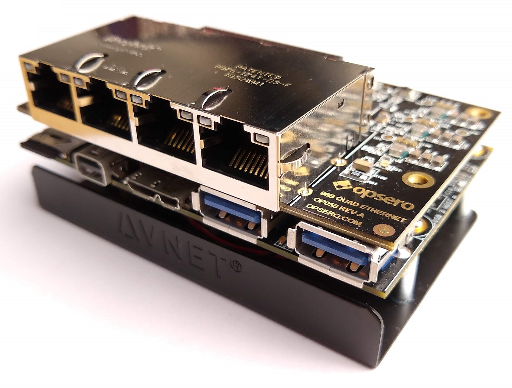

.. 96B Quad Ethernet Mezzanine documentation master file, created by
   sphinx-quickstart on Sat Mar 30 14:26:08 2019.
   You can adapt this file completely to your liking, but it should at least
   contain the root `toctree` directive.

96B Quad Ethernet Mezzanine
===========================

Description
-----------

The 96B Quad Ethernet Mezzanine is an add-on/expansion board for SoC based development platforms designed to
the 96Boards specification. The mezzanine card has 4x Texas Instruments DP83867 Gigabit Ethernet PHYs to provide
4 ports of gigabit Ethernet connectivity to the carrier development platform.

    
    96B Quad Ethernet Mezzanine on the Ultra96

Features
--------

* 4x TI `DP83867 <http://www.ti.com/product/DP83867CS>`_ Gigabit Ethernet PHYs
* Quad Ethernet RJ45 with magnetics
* Power and reset pushbuttons
* Low-speed expansion connector for stacking
* Supports the `Avnet Ultra96 v1 and v2 <https://www.96boards.org/product/ultra96/>`_ dev platforms
* Example designs for Vivado
* Standalone and PetaLinux example designs

Where to buy
------------

The mezzanine card can be purchased from Opsero's online shop at the link below:

`96B Quad Ethernet Mezzanine order page <https://opsero.com/product/96b-quad-ethernet-mezzanine/>`_

.. toctree::
   :maxdepth: 2
   :caption: Datasheet

   pin_configuration
   specifications
   detailed_description
   mechanical_info

.. toctree::
   :maxdepth: 2
   :caption: User Guide

   getting_started
   board_setup
   programming_guide
   references
