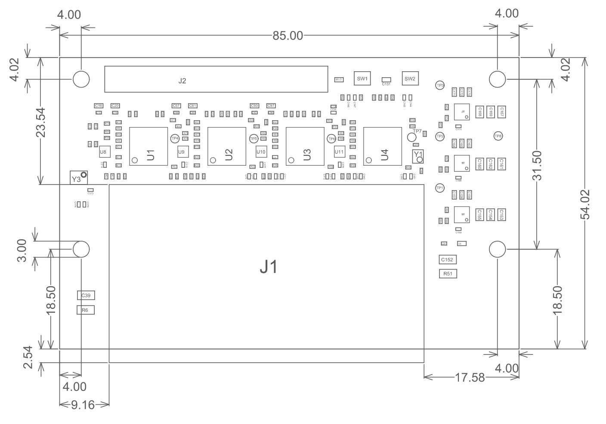

======================
Mechanical Information
======================

Dimensions
==========

The mechanical dimensions of the 96B Quad Ethernet Mezzanine card are illustrated
in the figure below. All dimensions are in millimeters (mm).

    
    96B Quad Ethernet Mezzanine mechanical drawing

The assembly drawing above is also available as a PDF at the link below:

  `96B Quad Ethernet Mezzanine Rev-A Assembly Drawing <http://ethernet96.com/download/96BQuadEth_ASSM_RevA.PDF>`_

3D Model
========

The 3D model of the board is available as a STEP file at the link below:

  `96B Quad Ethernet Mezzanine Rev-A 3D STEP model <http://ethernet96.com/download/96BQuadEthernetRevA-3D.zip>`_
